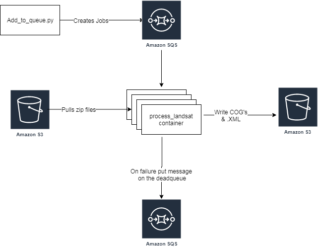

# Landsat-to-cog
Use this code to convert zipped USGS landsat data to cloud optimised geotiffs (cogs)
 using AWS infrastructure.
Also, this repository defines Docker and Kubernetes components to support the conversion.

# Requirements
- Two AWS SQS queues; one will be used to identify .zip files to cog, the other is a deadletter queue for failed jobs.
- AWS S3 buckets; used to store the input zip files and the output COG's.
- IAM Permissions need to be set up correctly to access the queues and S3 buckets.

## Application Architecture

